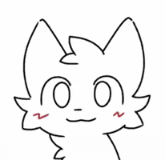
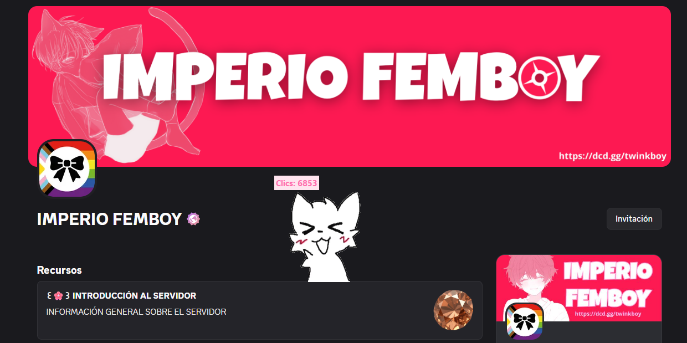

<div align="center">




<br/>

**Una mascota que vive en tu escritorio, reacciona a cada clic y cuenta cuánto le has hecho caso.**

<br/>

[](https://www.python.org/)
[](#-instalación)
[](#-licencia)
[](https://discord.gg/uxRavuMMdm)

</div>

<br/>

## 💗 ¿Qué es esto?

**BoyKisser Desktop** es una mascota de escritorio hecha con Python. Flota sobre tus ventanas **sin fondo** (solo se ve el personaje), respira con una animación en bucle y **reacciona cada vez que haces clic o pulsas una tecla**, con sonidos, hitos y un contador que no se olvida de ti aunque cierres el programa.

<div align="center">

<!-- Guarda tu captura como docs/preview.png (la del contador de clics) -->


</div>

<br/>

## ✨ Características

<table>
<tr>
<td width="50%" valign="top">

### 🐾 Mascota animada
Reposo en bucle con `stand.gif` y animación de reacción con `1.png, 2.png, 3.png…`. Si haces clic muchas veces seguidas, entra en un bucle corto más intenso.

</td>
<td width="50%" valign="top">

### 🫥 Fondo realmente transparente
En Windows se recorta el fondo de verdad, sin recuadros ni bordes raros. En otros sistemas usa un fondo pastel de respaldo.

</td>
</tr>
<tr>
<td valign="top">

### 🖱️ Ratón y ⌨️ teclado
Cuenta clics, pulsaciones o ambos a la vez. Tú decides qué cuenta como «cariño».

</td>
<td valign="top">

### 🔢 Contador con hitos
Tu progreso se guarda solo. Al llegar a 10, 100, 500, 1 000, 50 000… salta una notificación con sonido. 🎉

</td>
</tr>
<tr>
<td valign="top">

### 🔊 Sonidos a tu gusto
Un sonido aleatorio en cada clic y otro al cerrar. Solo tienes que soltar tus `.mp3`, `.wav` o `.ogg` en las carpetas.

</td>
<td valign="top">

### 🎀 Tema pastel
Interfaz blanco-rosada y semitransparente, sin ajustes de más que romper.

</td>
</tr>
</table>

<br/>

## Instalación

**1.** Descarga o clona el repositorio

```bash
git clone https://github.com/dotva/BoyKisser_DesktopPartner.git
cd BoyKisser_DesktopPartner
```

**2.** Instala las dependencias

```bash
pip install pygame pillow pynput
```

> 💡 Opcional, solo si quieres la opción *«Iniciar con Windows»*: `pip install pywin32`

**3.** Ejecútalo

```bash
python app.py
```

¡Y ya está! Aparecerá tu compañero en pantalla.

<br/>

## Cómo se usa

| Acción | Qué pasa |
|:--|:--|
| **Clic izquierdo** (en cualquier sitio) | Animación, sonido y +1 al contador |
| **Arrastrar** la mascota | La mueves por el escritorio (recuerda su posición) |
| **Clic derecho** sobre ella | Menú con *Configuración* y *Cerrar* |
| <kbd>Ctrl</kbd> + <kbd>Alt</kbd> + <kbd>S</kbd> | Abre la configuración |
| <kbd>Ctrl</kbd> + <kbd>Alt</kbd> + <kbd>M</kbd> | Silencia / activa el audio |

<br/>

## Ponle tus propias imágenes y sonidos

<details>
<summary><b>Ver estructura de carpetas</b></summary>

<br/>

```text
📁 assets/
 ├─ main.png            → imagen de repuesto si no hay stand.gif
 ├─ 📁 click/
 │   ├─ stand.gif       → reposo en bucle (cuando no haces clic)
 │   ├─ 1.png           → animación de clic, en orden numérico
 │   ├─ 2.png
 │   └─ 3.png …         → al terminar, vuelve al stand.gif
 └─ 📁 bye/
     └─ *.mp3 / .wav / .ogg   → despedida aleatoria al cerrar
📁 sounds/
 └─ *.mp3 / .wav / .ogg       → sonido aleatorio en cada clic
```

Pulsa **«Recargar imágenes y sonidos»** en *Configuración → Apariencia* para verlos al momento, sin reiniciar.

> **Consejo:** usa GIF o PNG **con fondo transparente**. Si falta todo, la app no se rompe: muestra un corazoncito provisional y te avisa.

</details>

<details>
<summary><b>Qué puedes cambiar en la configuración</b></summary>

<br/>

| Sección | Opciones |
|:--|:--|
| 🎨 **Apariencia** | Tamaño (150 / 200 / 300 px), siempre encima, fondo transparente, opacidad |
| 🔊 **Audio** | Silenciar, volumen, botón de prueba |
| 🧩 **Comportamiento** | Contar ratón y/o teclado, iniciar con Windows, iniciar minimizado, arrastrar, mostrar contador, atajos |
| 💬 **Redes sociales** | Discord y GitHub |
| 🛠️ **Avanzado** | Registro de depuración, exportar / importar configuración, reiniciar contador |

</details>

<br/>

## 💬 Comunidad

<div align="center">

### ¡Únete al **IMPERIO FEMBOY**! 👑

Novedades, eventos, ideas y memes.

[](https://discord.gg/uxRavuMMdm)
[](https://github.com/dotva/BoyKisser_DesktopPartner)

</div>

<br/>

## 📜 Licencia

Proyecto **gratuito y de uso libre**. Hecho en gran parte con ayuda de IA y con supervisión humana. Disfrútalo y compártelo. 💗
> soy tremendo vago pero con un objetivo claro

<br/>

<div align="center">


</div>